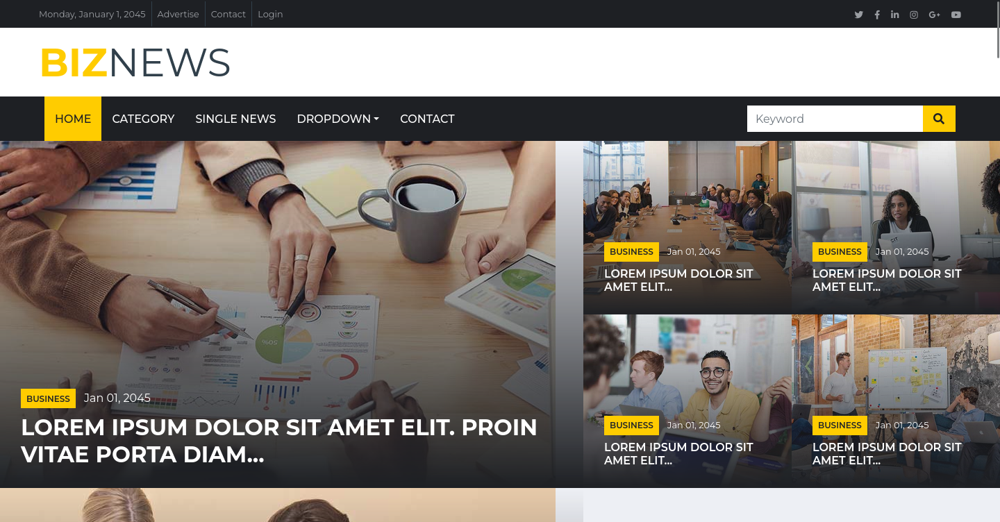
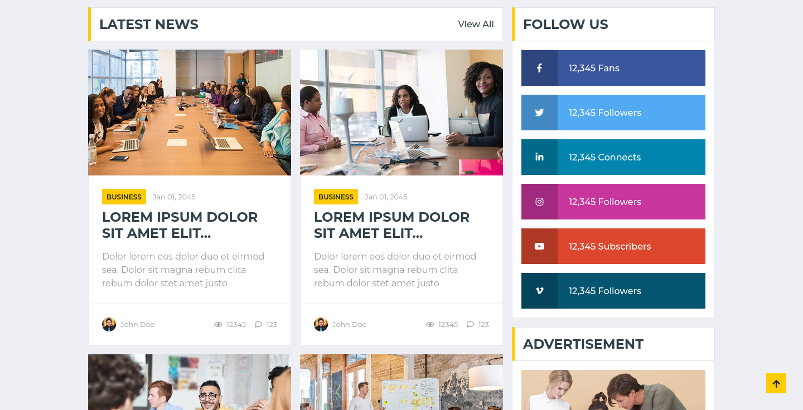
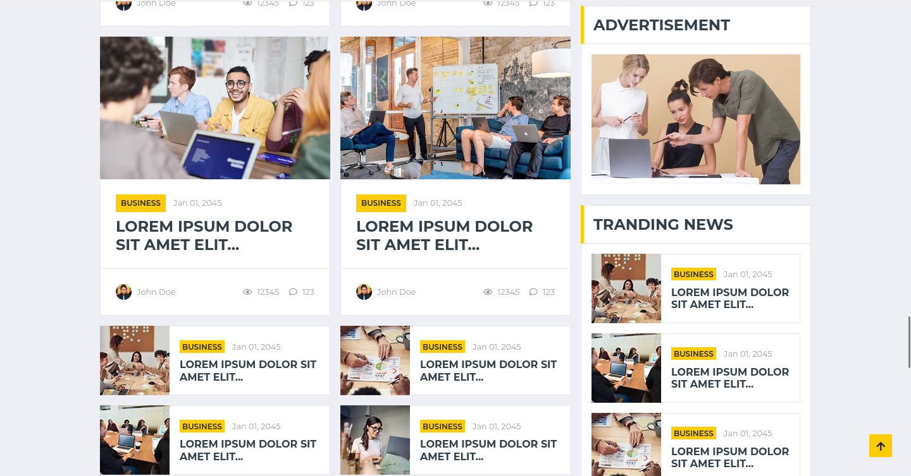
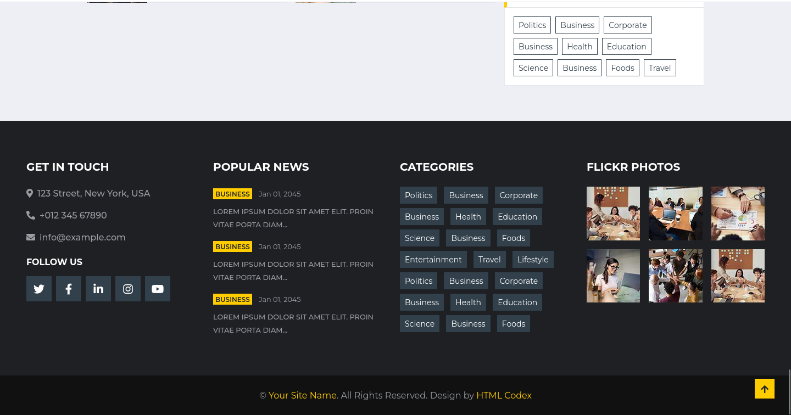

# News

A simple Django-based news website project.

## Features
- Home page, contact page, and category page with ready-to-use HTML templates
- Django admin interface
- Static files and media support

## Project Structure
- `manage.py`: Django’s command-line utility
- `news/`: Project settings and configuration
- `website/`: Main app with views, URLs, and (optionally) models
- `templates/`: HTML templates for the app
- `statics/`: Static files (CSS, JS, images)
- `requirements.txt`: Python dependencies

## Setup Instructions

### 1. Clone the repository
```bash
git clone <your-repo-url>
cd News
```

### 2. Create and activate a virtual environment (recommended)
```bash
python3 -m venv venv
source venv/bin/activate
```

### 3. Install dependencies
```bash
pip install -r requirements.txt
```

### 4. Apply migrations
```bash
python manage.py migrate
```

### 5. Run the development server
```bash
python manage.py runserver
```
Visit [http://127.0.0.1:8000/](http://127.0.0.1:8000/) in your browser.

### 6. (Optional) Create a superuser for the admin panel
```bash
python manage.py createsuperuser
```
Visit [http://127.0.0.1:8000/admin/](http://127.0.0.1:8000/admin/)

## App Endpoints
- `/` : Home page
- `/contact` : Contact page
- `/category` : Category page

## Notes
- The project uses SQLite by default (no setup needed).
- Static files are served from the `statics` directory.
- Templates are in the `templates` directory.
- No custom models are defined yet; you can add them in `website/models.py`.

## License
See [LICENSE](LICENSE). 


## Screenshots

### Home Page (1)


### Home Page (2)


### Home Page (3)


### Footer
 

